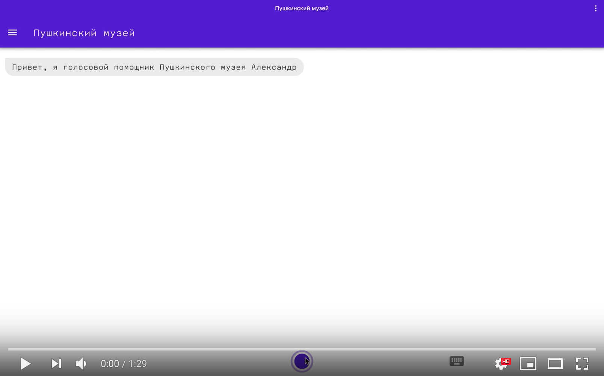

# vk-hack-yellow-dc
### Project name: Голосовой помощник Александр Сергеевич

### Punchline: В Пушкинский вместе с Александром Сергеевичем!

### Description: Заходите к [нам](https://demo134.bravo.vkhackathon.com/pushkinmuseum.apk)!

Также существует возможность открыть приложение по [ссылке](https://demo134.bravo.vkhackathon.com) в Chrome и даже установить его как приложение, однако этот вариант опционален. Работоспособность гарантируется только для Chrome :)

### Посмотрите наше демо!

### И полюбуйтесь скриншотами

