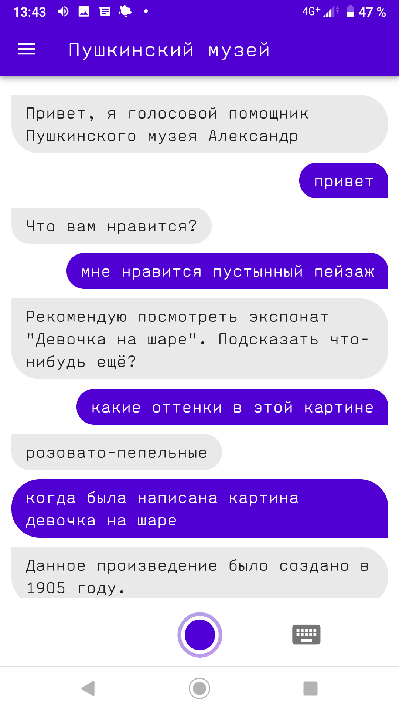
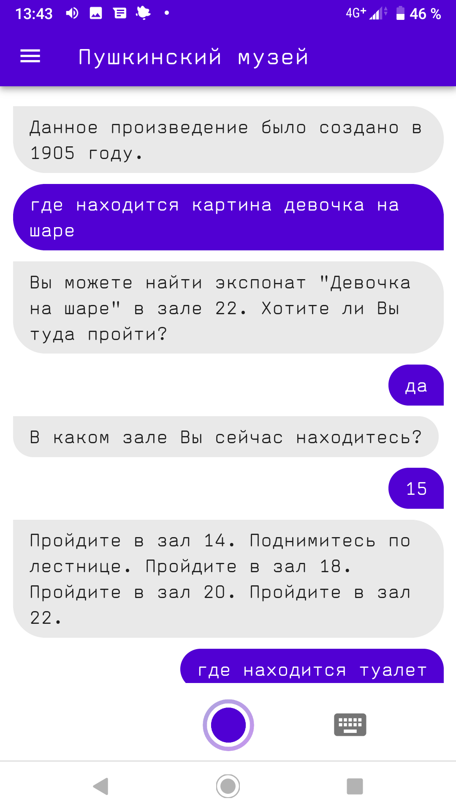

# vk-hack-yellow-dc
### Project name: Голосовой помощник Александр Сергеевич

### Punchline: В Пушкинский вместе с Александром Сергеевичем!

### Description: Вы можете скачать [.apk](https://demo134.bravo.vkhackathon.com/pushkinmuseum.apk) файл и установить приложение на свой android.

Также существует возможность открыть приложение по [ссылке](https://demo134.bravo.vkhackathon.com) в Chrome и даже установить его как приложение, однако этот вариант опционален. Работоспособность гарантируется только для [.apk](https://demo134.bravo.vkhackathon.com/pushkinmuseum.apk)  и установки на Android :)

### Посмотрите наше демо!

### Или просто полюбуйтесь скриншотами

